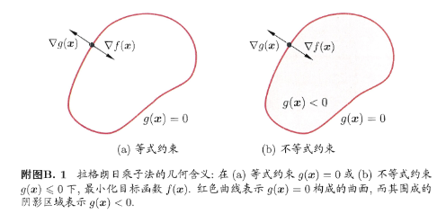

## 拉格朗日乘子法
有空还是翻一翻高数书。这里涉及基础的拉格朗日乘子法，和对偶函数。

引入拉格朗日乘子，将有d个变量与k个约束条件的最优化问题转化为具有d+k个变量的无约束问题。

$x$ 为 $d$ 维向量，要寻找 $x^*$ ，使目标函数 $f(x)$ 最小并且满足 $g(x)=0$ 的约束。从几何上看，是在由方程 $g(x)=0$ 确定的 $d-1$ 维曲面上寻找能使 $f(x)$ 最小化的点。

* 对于约束曲面上的任意点x，该点的梯度 $\nabla g(x)$ 正交于约束曲面
* 在最优点 $x^*$ ，目标函数的梯度 $\nabla f(x^*)$ 正交于约束曲面。（若 $\nabla f(x^*)$ 不与约束曲面正交，则仍可在约束曲面上移动使函数值进一步下降。

在最优点 $x^*$ ，梯度 $\nabla f(x)$ 和 $\nabla g(x)$方向相同或相反：

$$
\nabla f(x^*)+\lambda \nabla g(x^*)=0 \\
\lambda \geq 0
$$

对等式约束 g(x)=0 ，就可以转化为无约束问题，拉格朗日函数：

$$
L(x,\lambda)=f(x)+\lambda g(x)
$$

考虑不等式约束 $g(x) \leq 0$  。当 $g(x) < 0$  ，约束不起作用，可以直接通过 $\nabla f(x)=0$ 获得最优点；当 $g(x) = 0$ ，与上述等式约束相似，不过 梯度 $\nabla f(x^*)$ 和 $\nabla g(x^*)$ 此时必相反（**此处还是有点疑问）**，即 $\lambda >0$ 。拉格朗日函数的约束可以转化为：

$$
\begin{cases}
g(x) &\leq 0 \\
\lambda &\geq 0 \\
\lambda g(x) &= 0
\end{cases}
$$

这个约束称之为 $KKT$ 条件。推广到多个约束，有 $m$ 个等式约束， $n$ 个不等式约束，可行域 $D \subset \mathcal{R}^d$ , 优化问题：

$$
\begin{aligned}
\min_{x} &f(x) \\
s.t. \ &h_i(x)=0 \ (i=1,\ldots,m), \\
&g_i(x) \leq 0 \ (j=1,\ldots,n)
\end{aligned}
$$

引入拉格朗日乘子后，相应的拉格朗日函数和KKT约束：

$$
\begin{aligned}
L(x,\lambda,\mu)&=f(x)+\sum_{i=1}^{m} \lambda_i h_i(x) +\sum_{j=1}^n \mu_j g_j(x)\\
KKT &\begin{cases}
g_j(x) &\leq 0;\\
\mu_j &\geq 0;\\
\mu_j g_j(x) &=0;\\
\end{cases}
\end{aligned}
$$

## 高斯分布

对于单变量：

$$
\begin{aligned}
p(x \mid \mu ,\sigma^2)&=\mathcal{N}(x \mid \mu,\sigma^2)=-\frac{1}{\sqrt{2 \pi \sigma^2}} exp\{-\frac{(x-\mu)^2}{2\sigma^2}\} ;\\
\mathbb{E}[x]&=\mu;\\
\mathbb{var}[x]&=\sigma.
\end{aligned}
$$

对于 $d$ 维向量 $x$ ,多元高斯分布，涉及正定协方差矩阵 $\Sigma$ ：

$$
\begin{aligned}
p(x \mid \mu,\Sigma)&=\mathcal{N}(x \mid \mu,\Sigma)\\
&=\frac{1}{\sqrt{(2\pi)^d}\det(\Sigma)} exp\{-\frac{1}{2}(x-\mu)^T \Sigma ^{-1} (x-\mu)\};\\
\mathbb{E}[x]&=\mu;\\
\mathbb{cov}[x]&=\Sigma.
\end{aligned}
$$

协方差矩阵 $\Sigma$ 的计算方法如下：

设样本集 $\{x_1, x_2, \ldots, x_n\}$，每个 $x_i$ 为 $d$ 维向量，样本均值为 $\mu=\frac{1}{n}\sum_{i=1}^n x_i$，则协方差矩阵 $\Sigma$ 计算公式为：

$$
\Sigma = \frac{1}{n} \sum_{i=1}^n (x_i - \mu)(x_i - \mu)^T
$$

其中，$\Sigma$ 是 $d \times d$ 的对称正定矩阵，反映各维度之间的线性相关性。