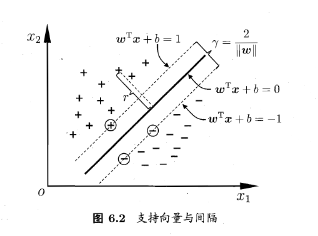
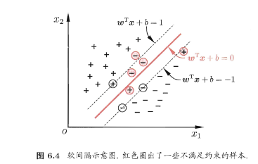
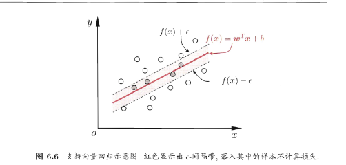

# SVM

## 基本型：

$$
\begin{aligned}
&\min_{\boldsymbol{w},b} \frac{1}{2} \|\boldsymbol{w}\|^2 \\
&s.t. \ y_i(\boldsymbol{w}^T\boldsymbol{x_i}+b) \geq 1, \ i=1,2,\ldots,m.
\end{aligned}
$$

使用拉格朗日乘子法：

$$
\begin{aligned}
L(\boldsymbol{w},b,\boldsymbol{\alpha})&=\frac{1}{2}\|\boldsymbol{w}\|^2+\sum_{i=1}^m \alpha_i(1-y_i(\boldsymbol{w}^T\boldsymbol{x_i}+b))  \\
KKT&\begin{cases}
\alpha_i &\geq 0 \\
1-y_i(\boldsymbol{w}^T\boldsymbol{x_i}+b)&\leq 0 \\
\alpha_i(1-y_i(\boldsymbol{w}^T\boldsymbol{x_i}+b))&=0
\end{cases}\\
\end{aligned}
$$

## 对偶问题：

$$
\begin{aligned}
\frac{\partial L(\boldsymbol{w},b,\boldsymbol{\alpha})}{\partial \boldsymbol{w}} &= 0 \rightarrow \boldsymbol{w}=\sum_{i=1}^m \alpha_iy_i\boldsymbol{x_i},\\
\frac{\partial L(\boldsymbol{w},b,\boldsymbol{\alpha})}{\partial b }&=0 \rightarrow 0=\sum_{i=1}^m \alpha_i y_i \\
\max _{\boldsymbol\alpha}L(\boldsymbol{w},b,\boldsymbol{\alpha})&=\frac{1}{2}\|\sum_{i=1}^m\alpha_iy_i\boldsymbol{x_i}\|^2+\sum_{i=1}^m\alpha_i-\sum_{i=1}^m\sum_{j=1}^m\alpha_i\alpha_jy_iy_j\boldsymbol{x_j}^T\boldsymbol{x_i}\\
&=\sum_{i=1}^m\alpha_i-\frac{1}{2}\sum_{i=1}^m\sum_{j=1}^m\alpha_i\alpha_jy_iy_j\boldsymbol{x_j}^T\boldsymbol{x_i}\\
&s.t. \sum_{i=1}^m \alpha_iy_i=0\\
&\alpha_i \geq 0, i=1,2,3,\ldots,m
\end{aligned}
$$

这样就转变为二次规划求得 $\boldsymbol{\alpha}$ 后再带入 $f(x)=\boldsymbol{w}^Tx+b$ :

$$
f(x)=\sum_{i=1}^m \alpha_iy_i\boldsymbol{x_i}^T\boldsymbol{x}+b
$$

只要保存 $\alpha_i \neq 0$ 的样本 $(x_i,y_i)$ 即可，这些样本就是支持向量.

## 核函数

如果原始空间是有限维的，那么一定存在一个高维特征空间使样本可分。

将样本通过 $\phi(\cdot)$ 映射到高维空间 , $\phi(x)$ 为将 $x$ 映射后的特征向量。对偶问题中最后要计算 $x_i^Tx_j$ 即内积，高维空间中也要计算 $\phi(x_i)^T\phi(x_j)$ ，用一个核函数 $\kappa{(\cdot,\cdot)}$ 抽象这种内积：

$$
\kappa(x_i,x_j)=<\phi(x_i),\phi_(x_j)>=\phi(x_i)^T\phi(x_j)
$$

什么样的函数可作为核函数：

令 $\mathcal{X}$ 为输入空间, $\kappa(\cdot,\cdot)$ 是定义在 $\mathcal{X} \times \mathcal{X}$ 上的对称函数. $\kappa$ 是核函数当且仅当对于任意数据 $D = \{x_1,x_2,\dots,x_m\}$, “核矩阵” (kernel matrix) $\mathbf{K}$ 总是半正定的:

\[
\mathbf{K} =
\begin{bmatrix}
\kappa(x_1,x_1) & \cdots & \kappa(x_1,x_j) & \cdots & \kappa(x_1,x_m) \\
\vdots & & \vdots & & \vdots \\
\kappa(x_i,x_1) & \cdots & \kappa(x_i,x_j) & \cdots & \kappa(x_i,x_m) \\
\vdots & & \vdots & & \vdots \\
\kappa(x_m,x_1) & \cdots & \kappa(x_m,x_j) & \cdots & \kappa(x_m,x_m)
\end{bmatrix}.
\]

$$
\begin{aligned}
\kappa(x_i,x_j)&=exp(-\frac{\|x_i-x_j\|^2}{2\sigma^2})&，\sigma>0,高斯核 \\
\kappa(x_i,x_j)&=(x_i^Tx_j)^d&,d\geq1,多项式核
\end{aligned}
$$

## 其他变种

### 软间隔

目标变为：

$$
\min_{\boldsymbol{w},b} \|\boldsymbol{w}\|^2 +C\sum_{i=1}^m \mathcal{l}_{loss}(y_if(x_i)-1)
$$

### 支持向量回归

目标变为：

$$
\min_{\boldsymbol{w},b} \|\boldsymbol{w}\|^2 +C\sum_{i=1}^m \mathcal{l}_{loss}(f(x_i)-y_i)
$$

