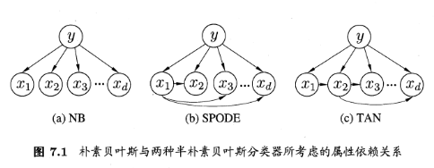
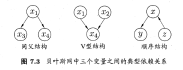

# 贝叶斯

## 贝叶斯决策论

有 $N$ 个标记， $\mathcal{Y}=\{c_1,c_2,\cdots,c_N\}$ , $\lambda_{ij}$ 表示将真实标记为 $c_j$ 的样本误分类为 $c_i$ 产生的损失。基于后验概率 $P(c_i \mid \boldsymbol{x})$ 可获得将 $\boldsymbol{x}$ 分类为 $c_i$ 产生的期望损失，也称样本 $\boldsymbol{x}$ 的条件风险。

$$
R(c_i \mid \boldsymbol{x}) =\sum_{j=1}^{N} \lambda_{ij} P(c_j \mid \boldsymbol{x})
$$

任务是寻找一个准则 $h:\mathcal{X} \rightarrow \mathcal{Y}$ 最小化总体风险：

$$
R(h)=\mathbb{E}_{\boldsymbol{x}}[R(h(\boldsymbol{x}) \mid \boldsymbol{x})]
$$

贝叶斯判定定理：最小化总体风险，只需在每个样本上选择那个能使条件风险 $R(c_i \mid \boldsymbol{x})$ 最小的 $c_i$ :

$$
h^*(\boldsymbol{x})=\arg\min_{c_i \in \mathcal{Y}} R(c_i \mid \boldsymbol{x})
$$

$1-R(h^*)$ 反应了机器学习能产生的模型精度的理论上限。

可知上面需要确定损失 $\lambda_{ij}$ 和 后验概率 $p(c_i \mid \boldsymbol{x})$ 。损失通常用 $0/1$ 损失，即分类正确为0，错误为1.此时 $h^*$ :

$$
h^*(\boldsymbol{x})= \arg \max_{c \in \mathcal{Y}} P(c \mid \boldsymbol{x})
$$

基于贝叶斯定理：

$$
P(c \mid \boldsymbol{x})=\frac{P(c)P(\boldsymbol{x} \mid c)}{P(\boldsymbol{x})}
$$

目标就转变为去获得 $P(c)$ 和 $P(\boldsymbol{x} \mid c)$

## 极大似然估计

假设关于类别 $c$ 的条件概率 $P(\boldsymbol{x} \mid c)$ 具有确定形式并且被参数向量 $\boldsymbol{\theta}_c$ 确定，记为 $P(\boldsymbol{x} \mid \boldsymbol{\theta}_c)$ 

概率模型的训练过程就是参数估计。关于参数估计，按参数是否是随机变量，有频率主义学派和贝叶斯学派。极大似然估计属于频率主义学派。

$D_c$ 表示训练集 $D$ 中 $c$ 类样本的集合。假设样本是独立同分布的，则参数 $\boldsymbol{\theta}_c$ 对 $D_c$ 的似然和极大似然：

$$
\begin{aligned}
P(D_c \mid \boldsymbol{\theta}_c)&=\prod_{\boldsymbol{x} \in D_c} P(\boldsymbol{x} \mid \boldsymbol{\theta}_c) \\
LL(\boldsymbol{\theta}_c)&=\log P(D_c \mid \boldsymbol{\theta}_c)\\
&=\sum_{\boldsymbol{x} \in D_c} \log P(\boldsymbol{x} \mid \boldsymbol{\theta}_c)\\
\hat{\boldsymbol{\theta}_c}&=\arg\max_{\boldsymbol{\theta}_c} LL(\boldsymbol{\theta}_c)
\end{aligned}
$$

可以通过 $LL(\boldsymbol{\theta}_c)$ 对 ${\boldsymbol\theta}_c$ 求导并使其为0计算得到 $\boldsymbol{\hat{\theta}}_c$ 

例如，假设 $p(\boldsymbol{x}\mid c) \sim \mathcal{N}(\boldsymbol{\mu}_c,\boldsymbol{\sigma}^2_c)$ .则参数 $\boldsymbol{\mu}_c$ 和 $\boldsymbol{\sigma}_c^2$ 的极大似然估计：

$$
\begin{aligned}
\hat{\boldsymbol{\mu}_c}&=\frac{1}{\lvert D_c \rvert }\sum_{\boldsymbol{x} \in D_c} \boldsymbol{x}, \\
\hat{\boldsymbol{\sigma}_c^2}&=\frac{1}{\lvert D_c \rvert }\sum_{\boldsymbol{x} \in D_c} (\boldsymbol{x}-\hat{\boldsymbol{\mu}_c})(\boldsymbol{x}-\hat{\boldsymbol{\mu}_c})^T
\end{aligned}
$$

这种估计参数的方法依赖于所假设的概率分布形式是否符合真实的数据分布。

## 朴素贝叶斯分类

假设属性之间相互独立：

$$
\begin{aligned}
P(c \mid \boldsymbol{x})&=\frac{P(c)P(\boldsymbol{x} \mid c)}{P(\boldsymbol{x})}=\frac{P(c)}{P(\boldsymbol{x})} \prod_{i=1}^d P(\boldsymbol{x_i} \mid c) \\
h(\boldsymbol{x})&=\arg \max_{c \in \mathcal{Y}} P(c) \prod_{i=1}^dP(\boldsymbol{x_i} \mid c)
\end{aligned}
$$

## 半朴素贝叶斯分类

$$
P(c \mid \boldsymbol{x}) \propto P(c)\prod_{i=1}^{d}p(x_i \mid c,pa_i)
$$

$pa_i$ 为属性 $i$ 依赖的属性。可以通过 $TAN$ 和最大带权生成树求解。

## 贝叶斯网

不详细讲解了，这是实际上图网络的内容

